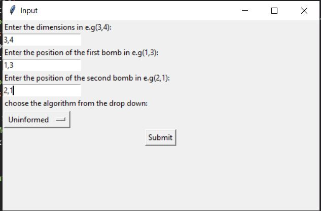
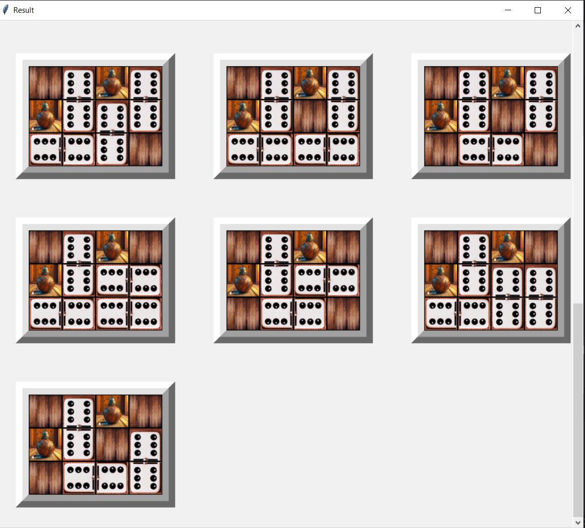
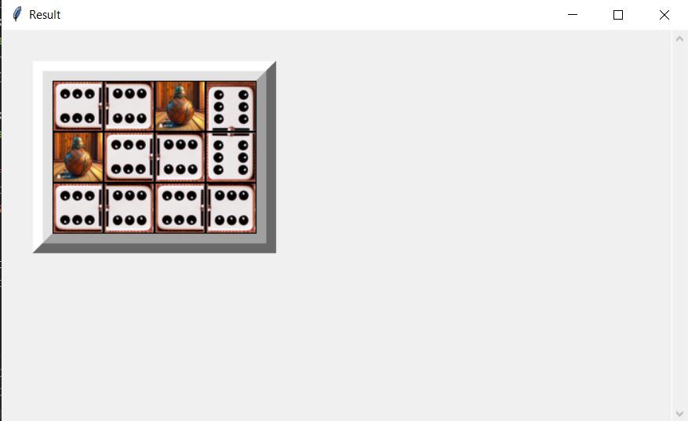

# Dominoes Puzzle Solver

**Introduction:**

This project aims to find optimal and non-optimal solutions for placing the maximum number of dominos on a given board with user-defined dimensions.

## Requirements
- Prolog version 8.4.2
- Pyswip
- numpy
- tkinter
- PIL (Pillow)

**Example Input**

## Uninformed Search

In the uninformed search, we attempt various combinations to fill the 2D space with dominos without considering the optimality of the placement. The primary requirement is to fill the entire board.

**Example:**

## Informed Search

In the informed search, we explore different combinations to maximize the number of dominos placed on the board using an A* search algorithm.

**Heuristic:**

We use the heuristic of maximizing the area of contiguous batches divided by 2 as a guiding factor.

**Example:**

